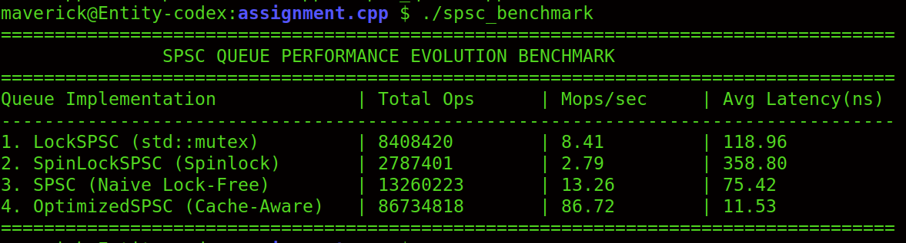

# SPSC Queue Benchmark

This project compares four ways to implement a single-producer, single-consumer (SPSC) queue in C++. The aim is to see how synchronization choices affect the time it takes to pass fixed-size objects between two threads.

The queue benchmark uses 64-byte objects and a fixed-capacity ring buffer. Each implementation runs the same producer/consumer workload so their results can be compared.

## Project files

```text
assignment/
├── LockSPSC.hpp          # Queue protected by std::mutex
├── SpinLockSPSC.hpp      # Queue protected by an atomic spinlock
├── spsc_queue.hpp        # Basic lock-free SPSC queue
├── OptimizedSPSC.hpp     # SPSC queue with cached indices
├── main.cpp              # Runs the benchmarks and checks the results
├── README.md
└── screenshots/
    └── benchmark.png     # Add your benchmark screenshot here
```

## Requirements

- A C++20 compiler, such as a recent version of GCC or Clang
- Thread support (`-pthread` on Linux)
- Windows (PowerShell), Linux, or macOS can be used to run the benchmark

## Build and run

From inside the `assignment` directory, compile the benchmark with GCC:

**Windows (PowerShell):**

```powershell
g++ -O3 -std=c++20 -pthread main.cpp -o spsc_benchmark.exe
.\spsc_benchmark.exe
```

**Linux or macOS:**

```bash
g++ -O3 -std=c++20 -pthread main.cpp -o spsc_benchmark
./spsc_benchmark
```

The program runs all four queue implementations, checks that the consumer receives the expected sequence of objects, and prints the number of transferred objects, throughput, average time per transfer, and a comparison against the mutex version.

## Implementations

### 1. `LockSPSC` — mutex

The mutex version uses `std::mutex` to protect the queue's buffer, indices, and count. Each `push()` and `pop()` takes the lock before accessing the queue.

This is the simplest version to reason about and is useful as a baseline. The downside is that both threads have to acquire the same lock for every queue operation.

### 2. `SpinLockSPSC` — spinlock

This version uses `std::atomic_flag` instead of `std::mutex`. If the lock is already held, the thread keeps checking until it becomes available.

A spinlock can work well when the critical section is very short and the lock is released quickly. It can also waste CPU time while waiting, and it may perform worse than a mutex when the threads contend or the operating system schedules them unfavourably.

### 3. `SPSCQueue` — basic lock-free queue

The basic lock-free queue does not use a mutex or spinlock. The producer updates the tail index, and the consumer updates the head index. Atomic indices and acquire/release memory ordering are used to coordinate access to the buffer.

The queue capacity must be a power of two. This lets the implementation wrap an index using a bit mask rather than a modulo operation.

### 4. `OptimizedSPSC` — cached indices

The optimized version builds on the basic lock-free queue. Each thread keeps a local copy of the index it owns and a cached copy of the other thread's index. It reloads the other index only when the cached value suggests that the queue might be full or empty.

The goal is to reduce repeated reads of the other thread's atomic index. Those reads can cause cache-coherence traffic between CPU cores. The published head and tail indices are also aligned to separate cache lines with `alignas(64)`, which can reduce false sharing on systems with 64-byte cache lines.

## Why the optimized queue may not be faster

The cached-index version is an optimization, but it is not guaranteed to win on every machine or for every benchmark. In the included test run, the basic lock-free queue was faster than the optimized version. That is a result worth reporting, not something to hide.

A few things can explain it:

- **The workload may be too short or too small.** The benefit of fewer atomic loads may not outweigh the extra branches and cached-index checks for this particular run.
- **The queue is frequently full or empty.** If the producer and consumer repeatedly hit those conditions, the optimized queue has to refresh the cached index often, so it gains less from caching.
- **CPU and cache behaviour differ.** The result depends on the processor, cache hierarchy, compiler, operating system, and thread scheduling.
- **The benchmark measures more than the queue operation.** Thread coordination, retry loops, and timing overhead can affect the result.
- **The optimization has a trade-off.** It reduces some cross-thread index loads but adds logic to decide when a refresh is needed. That logic is not free.

For a fairer comparison, run several trials, use the same build flags and workload for every implementation, and compare the median throughput. A warm-up run and a more carefully controlled start barrier can also help. Do not assume the optimized version is better just because it has more optimizations; keep the measurements and investigate the result.

## Benchmark results

The following results were collected on the author's Windows machine. Both runs used C++20, 64-byte objects, a queue capacity of 1024, and 2,000,000 transfers per implementation. Every implementation passed the program's verification check. Results vary between runs, so these figures should be treated as measurements of this machine and workload rather than universal performance guarantees.



### Results from two runs

| Implementation | Run 1 throughput (M objects/s) | Run 1 time (ns/transfer) | Run 2 throughput (M objects/s) | Run 2 time (ns/transfer) | Verified in both runs |
|---|---:|---:|---:|---:|---|
| LockSPSC (mutex) | 7.86 | 127.29 | 7.89 | 126.82 | Yes |
| SpinLockSPSC | 8.06 | 124.04 | 9.75 | 102.53 | Yes |
| Naive Lock-Free | 20.13 | 49.68 | 15.27 | 65.50 | Yes |
| Optimized Lock-Free | 9.54 | 104.81 | 18.85 | 53.05 | Yes |

### Interpretation

- **Naive Lock-Free** had the highest throughput in Run 1 at 20.13 million objects/s, about 2.56 times the mutex baseline.
- **Optimized Lock-Free** had the highest throughput in Run 2 at 18.85 million objects/s, about 2.39 times the mutex baseline.
- The spinlock was close to the mutex in Run 1 but faster in Run 2.
- The ranking changed between runs, especially for the two lock-free implementations. This shows why a single run is not enough to establish a stable performance ranking.

Possible causes of variation include thread scheduling, background processes, CPU power/thermal behaviour, and cache effects. For a more reliable comparison, run several additional trials under the same build configuration and workload, then compare the median throughput for each implementation. Avoid combining results from different executable builds.

### How the numbers are calculated

- **Throughput** = successfully transferred objects divided by elapsed seconds.
- **Average time per transfer** = elapsed seconds divided by successfully transferred objects, converted to nanoseconds.
- One transfer means an object was pushed successfully and then popped by the consumer. It does not count a push and a pop as two separate completed transfers.
- The program checks sequence numbers to help catch missing, duplicated, or out-of-order objects.

The reported average is an overall time per transfer. It is not a measurement of the latency distribution of individual `push()` or `pop()` calls.

## Notes and limitations

- These queues are designed for exactly one producer and one consumer. They are not general-purpose multi-producer or multi-consumer queues.
- The lock-free implementations use a preallocated buffer, so they do not allocate memory for each queue operation.
- `alignas(64)` assumes a common 64-byte cache-line size. Actual hardware can differ.
- Benchmark results depend on the environment. A higher result on one machine does not prove that an implementation will be faster everywhere.
- The benchmark should be run more than once before drawing conclusions.

## Git workflow

If you are working in a Git repository, you can create a feature branch and submit the work as a pull request:

```bash
git checkout -b feat/spsc-queue-benchmark
git add LockSPSC.hpp SpinLockSPSC.hpp spsc_queue.hpp OptimizedSPSC.hpp main.cpp README.md screenshots/benchmark.png
git commit -m "Add SPSC queue implementations and benchmark"
git push -u origin feat/spsc-queue-benchmark
```

Then open a pull request to the target branch specified for your assignment.
