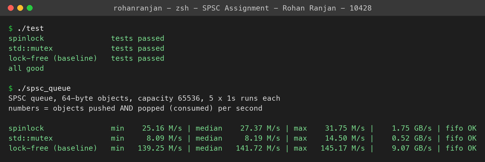

# SPSC Assignment - Rohan Ranjan - 10428

name: "Rohan Ranjan"

email: "rohan.24bcs10428@sst.scaler.com"

roll_no: "10428"

One producer thread pushes 64 byte objects into a queue and one consumer thread pops them.
Both run for 1 second and then I count how many objects went through.

## Files

- `spsc_queue.hpp` - the queue (ring buffer), my spinlock and the memory pool
- `spsc_queue.cpp` - the 1 second benchmark, runs spinlock, std::mutex and lock-free
- `test.cpp` - small tests with assert (empty/full, wrap around, order with 2 threads)
- `image.png` - screenshot of my run

## What I did

- `Order` struct is exactly 64 bytes (one cache line), checked with `static_assert`
- **Memory pool:** all 65536 slots are allocated once at the start (4 MB, 64 byte aligned),
  so there is no `new` / `delete` during push and pop
- The queue is a template on the lock type, so the same code runs with my own
  spinlock (`atomic_flag` in a while loop) and with `std::mutex`
- t1 = producer, t2 = consumer, main sleeps 1 sec, sets `stop`, then `t1.join()` and `t2.join()`
- Every object has a sequence number and the consumer checks they come out in the same order (`fifo OK`)
- I also added a lock-free version just to compare, it is not part of the assignment

## How to run

```
g++ -std=c++17 -O2 -pthread test.cpp -o test
./test

g++ -std=c++17 -O2 -pthread spsc_queue.cpp -o spsc_queue
./spsc_queue
```

## Per second specs

Machine: Apple M4 (10 cores), macOS, compiled with `-O2`

Each session = 5 runs of 1 second, this is the median of those 5
(objects pushed **and** popped per second):

| Session | spinlock | std::mutex | lock-free (baseline) |
|---|---|---|---|
| 1 | 25.65 M/s | 33.16 M/s | 143.92 M/s |
| 2 | 25.14 M/s | 10.52 M/s | 145.41 M/s |
| 3 | 24.02 M/s | 52.63 M/s | 149.54 M/s |
| 4 | 20.80 M/s | 52.22 M/s | 143.17 M/s |
| 5 | 27.37 M/s | 8.19 M/s | 141.72 M/s |

So roughly:

- **spinlock: ~21-27 million 64B objects per second** (~1.3-1.75 GB/s), pretty stable
- **std::mutex: anywhere from ~8 to ~53 million per second**, changes a lot between sessions
- lock-free: ~140-150 million per second (no lock at all, just for comparison)

Screenshot of session 5 (tests + benchmark):



## Notes

- With a lock, every push and pop has to grab the same lock, so the cache line with the
  lock keeps moving between the two cores. That is the main cost.
- The spinlock just keeps doing `test_and_set` in a loop, so its number stays about the same every time.
- std::mutex on mac spins a little and then puts the thread to sleep. When both threads
  stay on the fast cores it beat the spinlock by 2x, but when macOS moved a thread
  (Chrome etc. was also running) it dropped to ~8-10 M/s. So which one "wins" depends on the run.
- Lock-free is ~5x faster than the best lock run because the producer and consumer
  each own their own index and don't have to share a lock.
- Numbers will probably be different on Linux / x86.
