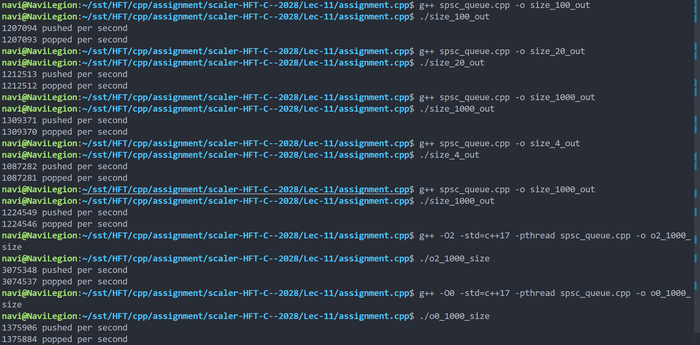

mail: naverdo.24bcs10076@sst.scaler.com

roll_no: 10076

Used a ring buffer SPSC queue with mutexes of various sizes and got results as in the image

Best time (out of the tested sizes) was with O2 optimisation and 1000 sized queue - ~3 million/s. No significant difference between std and -pthread on my system (Ubuntu 24 in WSL2, 14900hx).