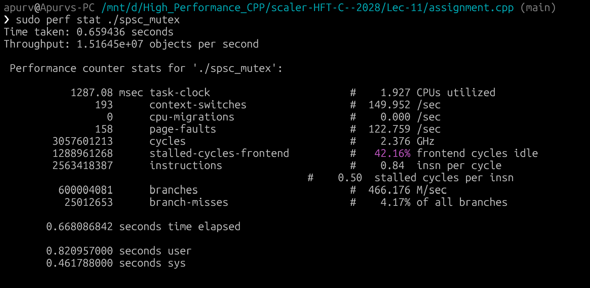
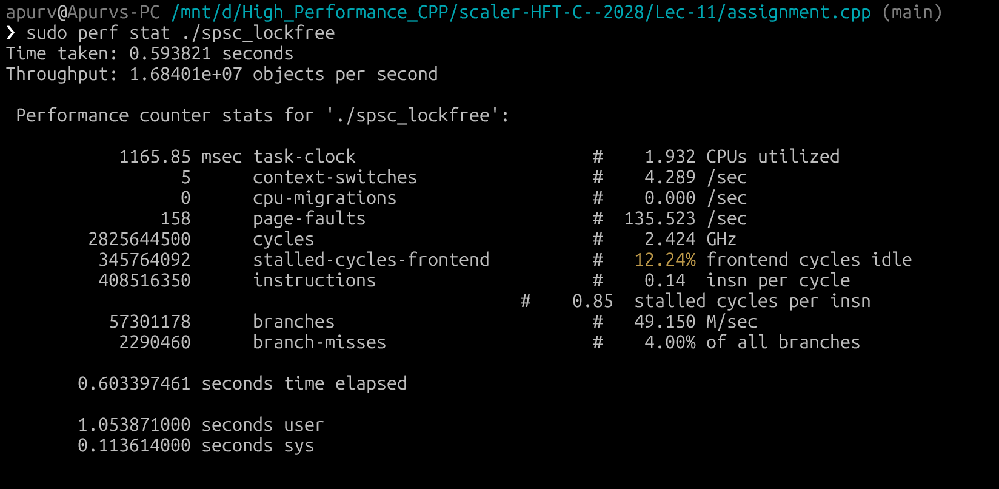

# SPSC Queue: Mutex vs. Lock-Free Performance Benchmark

- **Name:** Apurv Dugar  
- **Roll No:** 24BCS10107  
- **Email:** apurv.24bcs10107@sst.scaler.com  

---

## Benchmark Screenshots

### Mutex Implementation (`./spsc_mutex`)

### Lock-Free Implementation (`./spsc_lockfree`)

---

## Benchmark & `perf stat` Results

| Performance Metric | Mutex (`spsc_mutex`) | Lock-Free Atomics (`spsc_lockfree`) | Improvement / Delta |
| :--- | :--- | :--- | :--- |
| **Throughput** | **15.16 × 10⁶ objects/sec** | **16.84 × 10⁶ objects/sec** | **+11.1% faster** |
| **Elapsed Time** | `0.659 s` | `0.594 s` | **~10% faster wall clock** |
| **Instructions Executed** | `2,563,418,387` (2.56 B) | `408,516,350` (0.41 B) | **84.1% fewer instructions** |
| **CPU Cycles** | `3,057,601,213` (3.06 B) | `2,825,644,500` (2.83 B) | **7.6% fewer cycles** |
| **Context Switches** | **193** | **5** | **97.4% reduction** |
| **Frontend Cycle Stalls** | `42.16%` idle | `12.24%` idle | **71% reduction in pipeline stalls** |
| **Branch Misses** | `25,012,653` (4.17%) | `2,290,460` (4.00%) | **90.8% fewer branch misses** |
| **Kernel / System Time (`sys`)** | `0.462 s` | `0.114 s` | **75.4% reduction in OS kernel time** |
| **Page Faults** | `158` | `158` | Identical memory footprint |
| **Task Clock Time** | `1287.08 msec` | `1165.85 msec` | **~9.4% less active CPU time** |

---